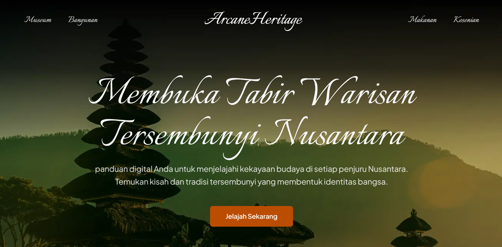

### Arcane Heritage - Melestarikan Warisan Nusantara



Panduan digital Anda untuk menjelajahi kekayaan budaya di setiap penjuru Nusantara. Temukan kisah dan tradisi tersembunyi yang membentuk identitas bangsa.

Dibuatnya web ini untuk mengenalkan ke anak muda dan orang tua tentang warisan budaya yang perlu dilestarikan bersama, untuk orang tua yang kadang dengan pandangan mata yang sudah terbatas, bisa pakai text to speeech detail deskripsi tanpa harus membaca teks.

Dan di web ini, setiap orang di seluruh daerah manapun bisa contribute as contributor untuk menambahkan data apapun yang mengenai budaya. Sehingga orang lain yang memakai aplikasi ini bisa mengetahui beraneka ragam budaya yang ada dan tersebar di indonesia.

Dilengkapi dengan video dan **Panorama View 360** di menu Museum, harapannya setiap client (visitor website) bisa merasakan secara langsung seperti mengunjungi tempat tersebut. (Feature in progress)

## Technology

- Next.js 15, Tailwind CSS, Shadcn UI, Magic UI, Zod, Typescript, Framer Motion, Neon Database (PostgreSQL), Prisma, Text to Speech API, Street View API, Vercel

## Features (Role as Client)

- Bangunan bersejarah - https://arcaneheritage.vercel.app/bangunan
- Makanan Tradisional - https://arcaneheritage.vercel.app/makanan
- Quiz Interactive - https://arcaneheritage.vercel.app/quiz
- Panorama 360deg (Street View 360) - (Work in progress) https://arcaneheritage.vercel.app/museum
- Text to Speech : Building Card, Food Card, Building Detail, Food Detail
- Dashboard (Manage All Data)

## Dashboard Features (Role as Contributor)

- Manage data Bangunan (Tambah data bangunan, Preview, Update Data dan Delete)
- Manage data Makanan (Tambah data bangunan, Preview, Update Data dan Delete)
- Manage Pertanyaan Quiz (Tambah Pertanyaan baru di Category spesifik)

#### Disclaimer : Untuk saat ini roles masih general, jadi setiap user registered juga bisa contribute akses ke dashboard.

## How to Install Dependencies and Run Project

First, install dependenecies :

```bash
npm install
```

And then run the development server:

```bash
npm run dev
```

Open [http://localhost:3000](http://localhost:3000) with your browser to see the result.

Information : Untuk melihat daftar bangunan, quiz dan makanan, diharuskan untuk akses [SignIn](https://arcaneheritage.vercel.app/signin) page , dan tambah data dulu lewat menu [Dashboard](https://arcaneheritage.vercel.app/dashboard), dan setelah itu bisa akses di page nya.
